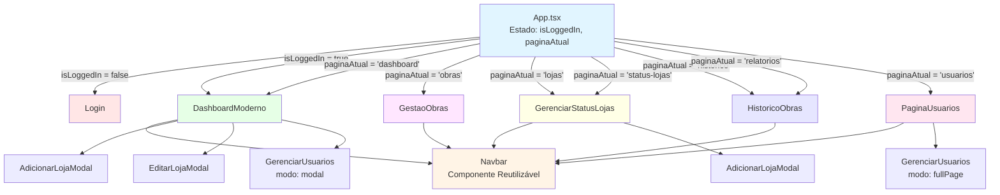

# 📊 Diagrama de Componentes - Sistema de Gestão de Obras

## 🏗️ Estrutura de Navegação



## 🔗 Mapa de Rotas

| ID da Página | Componente Renderizado | Props Principais |
|--------------|------------------------|------------------|
| `dashboard` | DashboardModerno | onLogout, onNavigate |
| `obras` | GestaoObras | onLogout, onNavigate |
| `lojas` | GerenciarStatusLojas | onVoltar, onLogout, onNavigate |
| `status-lojas` | GerenciarStatusLojas | onVoltar |
| `historico` | HistoricoObras | onVoltar, onLogout, onNavigate |
| `relatorios` | **HistoricoObras** ⚠️ | onVoltar, onLogout, onNavigate |
| `usuarios` | PaginaUsuarios | onLogout, onNavigate |

⚠️ **Nota**: `relatorios` e `historico` apontam para o **mesmo componente** (HistoricoObras)

## 🧭 Navbar - Links de Navegação

```
┌─────────────────────────────────────────────────────────┐
│  [Logo]  Rodrigues Colchões                             │
│                                                          │
│  🏠 Dashboard   🔨 Gestão de Obras   ✅ Histórico       │
│  🏢 Lojas       📊 Relatórios       👥 Usuários*        │
│                                                          │
│                              [Usuário] [Sair]           │
└─────────────────────────────────────────────────────────┘

* Usuários: apenas para nível 'master'
```

### Mapeamento Navbar → App.tsx

| Menu Item | onClick navega para | Renderiza Componente |
|-----------|---------------------|---------------------|
| 🏠 Dashboard | `'dashboard'` | DashboardModerno |
| 🔨 Gestão de Obras | `'obras'` | GestaoObras |
| ✅ Histórico | `'historico'` | HistoricoObras |
| 🏢 Lojas | `'lojas'` | GerenciarStatusLojas |
| 📊 Relatórios | `'relatorios'` | HistoricoObras |
| 👥 Usuários | `'usuarios'` | PaginaUsuarios |

## 📦 Fluxo de Props

### App.tsx → Componentes de Página

```typescript
// Props comuns passadas do App.tsx
{
  onLogout: () => setIsLoggedIn(false),
  onNavigate: setPaginaAtual,
  onVoltar: () => setPaginaAtual('dashboard' ou 'obras')
}
```

### Páginas → Navbar

```typescript
// Props passadas para Navbar
{
  darkMode: boolean,              // do localStorage
  currentPage: string,            // 'dashboard', 'obras', etc.
  onNavigate: (page) => void,     // função recebida do App.tsx
  onLogout: () => void,           // função recebida do App.tsx
  userName: string,               // do localStorage usuario.nome
  userLevel: string               // do localStorage usuario.nivel_acesso
}
```

## 🎯 Estado Global (localStorage)

```javascript
{
  authToken: "JWT token",
  usuario: {
    id: number,
    nome: string,
    email: string,
    nivel_acesso: 'master' | 'gerente' | 'usuario'
  },
  darkMode: boolean
}
```

## 🔄 Ciclo de Navegação

```
Usuário clica em menu da Navbar
         ↓
Navbar chama onNavigate(pageId)
         ↓
App.tsx recebe setPaginaAtual(pageId)
         ↓
paginaAtual é atualizado
         ↓
Re-render com novo componente
         ↓
Novo componente renderiza Navbar com currentPage atualizado
```

## 🛠️ Componentes Reutilizáveis

### Modais
- **AdicionarLojaModal**: Usado em Dashboard e GerenciarStatusLojas
- **EditarLojaModal**: Usado em Dashboard
- **GerenciarUsuarios**: 
  - Dashboard (modal)
  - PaginaUsuarios (fullPage)

### Services (API)
- `authService`: Login, logout, verificação
- `lojasService`: CRUD de lojas
- `obrasService`: CRUD de obras
- `custosService`: CRUD de lançamentos
- `relatoriosService`: Dados analíticos

## 📝 Observações

1. **Duplicação**: `relatorios` e `historico` usam o mesmo componente
2. **Status-lojas**: Rota secundária que volta para 'obras'
3. **GerenciarUsuarios**: Funciona como modal OU página completa
4. **Navbar**: Presente em TODAS as páginas (exceto Login)
5. **ErrorBoundary**: Envolve toda a aplicação

## 🎨 Hierarquia Visual

```
App
 ├── ErrorBoundary
 │    ├── Login (se não autenticado)
 │    └── Páginas (se autenticado)
 │         ├── DashboardModerno
 │         │    ├── Navbar
 │         │    ├── AdicionarLojaModal
 │         │    ├── EditarLojaModal
 │         │    └── GerenciarUsuarios (modal)
 │         │
 │         ├── GestaoObras
 │         │    └── Navbar
 │         │
 │         ├── GerenciarStatusLojas
 │         │    ├── Navbar
 │         │    └── AdicionarLojaModal
 │         │
 │         ├── HistoricoObras
 │         │    └── Navbar
 │         │
 │         └── PaginaUsuarios
 │              ├── Navbar
 │              └── GerenciarUsuarios (fullPage)
```
